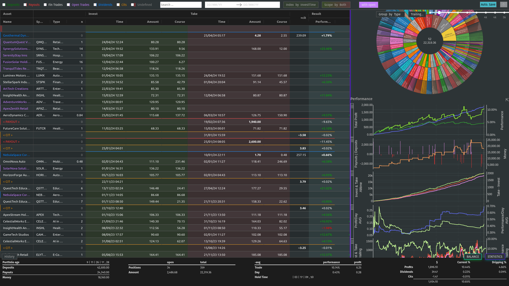
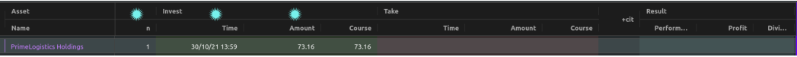
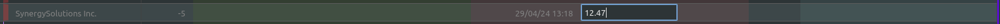
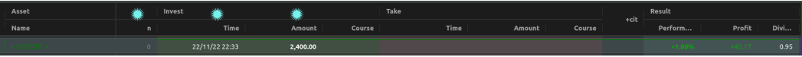
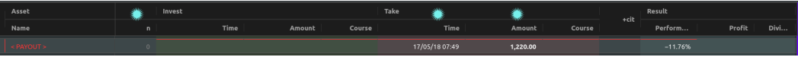
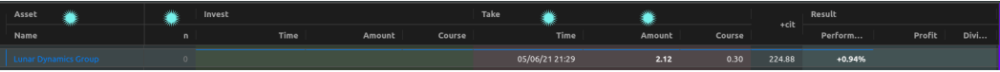
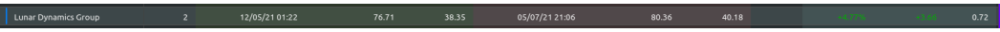
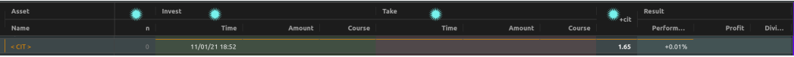

.. role:: html(raw)
   :format: html

============================
Simple Rich Trading Protocol
============================

0.1 #1 (2024-04-27)
    The project is still being worked on and some scenarios have not been tested.

Install and Run
===============

- Install the latest version of the `Python interpreter`_. At least version 3.10 is required.

- Open the terminal and navigate in the project folder.

- Install the required packages.

(the program name ``python`` could be different depending on the operating system or
version, e.g. ``python3`` or ``py``)

::

    > python -m pip install -r requirements.txt

Start through

::

    > python main.py

The following message is displayed in the terminal:

::

    Dash is running on http://127.0.0.1:8050/

     * Serving Flask app 'Simple Rich Trading Protocol'
     * Debug mode: off
    WARNING: This is a development server. Do not use it in a production deployment. Use a production WSGI server instead.
     * Running on http://127.0.0.1:8050
    Press CTRL+C to quit

Visit the link in your browser.

Demo
====

A demo is available for testing purposes. Start it by

::

    > python demo

Create and start your own demo as follows

::

    > python demo make='your demo id'
    > python demo 'your demo id'

Records
=======

General information
-------------------

- The first record must be a deposit.

- Some columns have a slightly different meaning or function depending on the type of record.

- The time entries in the *InvestTime* and *TakeTime* columns are parsed automatically and
  can be entered according to the following patterns:

    | ``[MM]``
    | ``[hh][MM]``
    | ``[dd][HH][MM]``
    | ``[dd][mm][HH][MM]``
    | ``[dd][mm][yy][HH][MM]``

    | With the exception of the last field from the left, all fields must have two digits.
    Characters from ``[ .,:/-]`` are allowed between the fields but are not required. If fields
    are omitted, they are filled from the current date. To apply the current date in full,
    a character from ``[n#0]`` can be entered.

- ITC stands for 'Interests, Taxes and other Costs or Income'.

Trades
------

Enter a value greater than ``0`` in the column *n* and define the cells of the columns
*InvestTime* and *InvestAmount* or *InvestCourse* to open a trade. The value from the
*ITC* column is subtracted or added to the final profit in the calculations.

If a value is entered in *TakeAmount* or *TakeCourse* but not in *TakeTime*, the trade
is still considered to be open, the *Profit* and *Performance* cell is calculated and,
if ``with open`` is active, also the summary footer and a visible side section.

A trade is considered finalized if *TakeTime* is also defined.

Another way to close positions is to give the log a closing instruction.
This can also be used to close several individual positions at once or to close individual
positions only partially.

To do this, enter the appropriate *Name*, a negative number *n*, the *TakeTime*
and the *TakeAmount* or *TakeCourse* in a free row.

Deposits
--------

Enter a ``0`` in the column *n* and define the cells of the columns *InvestTime* and
*InvestAmount* to define a deposit. The value from the *ITC* column is subtracted or
added to the amount in the calculations.

The column *Profit* contains the sum of the profits of the following trades in relation to
non-exhausted previous or interim deposits. *Performance* is then calculated in relation to
the amount. The value in *Dividend* is calculated like *Profit*.

Entries in the column group *Take* are not accepted, these are defined by the program
based on following payouts. Once the amount has been exhausted, the deposit record
will no longer receive a profit value from that point on.

Payouts
-------

Enter a ``0`` in the column *n* and define the cells of the columns *TakeTime* and
*TakeAmount* to define a payout. The value from the *ITC* column is subtracted
or added to the amount in the calculations.

Payouts are deducted from the sum of deposits, but not from profits. However, if the
payouts exceed the available money, a ITC record is created from the remaining amount.

Entries in the column group *Invest* are not accepted.

The value in *Performance* represents the rate to the sum of previous deposits.

Dividends
---------

For a dividend record it is important to enter a *Name* first, then enter a ``0`` in
the column *n* and define the cells of the columns *TakeTime* and *TakeAmount* or
*TakeCourse*.

Entries in the column group *Invest* or column *ITC* are not accepted.

If the dividend is defined in column *TakeCourse*, its amount is calculated with the sum of
column *n* of previous associated trades. The *ITC* column represents the sum of the
*InvestAmount*'s of those trades. This is then used to calculate *Performance* to represent
the dividend rate.

A trade belongs to the dividend if the *Name* is identical and it is open at the time of the
dividend. The *Dividend* column of these associated trades is calculated in proportion to the
*InvestAmount*.

Interests, Taxes and other Costs or Income (ITC)
------------------------------------------------

Enter a ``0`` in the column *n* and define the cell of the column *ITC* and
*InvestTime* or *TakeTime* to define a ITC record.

A ITC record is deducted or added to the profit.

Entries in the columns *InvestAmount* or *TakeAmount* are not accepted.

The value in *Performance* represents the rate to the sum of previous deposits.

Nice to know
============

- The project has so far only been tested on ``Mozilla Firefox 125.0.2`` on Linux.

- Before the log is (further) edited, large calculations should be completed.

- When calculations are running, ``working...`` is displayed in the tab label.

- The log is recalculated when a defined record is detected or changed.

- Reload the page to reorder all the records.

- Copy/paste functions are implemented but still buggy.

    | Supported actions:
    ======================== ===========================================================
    ctrl+c                   write a cell content to the clipboard.
    ctrl+x                   write a cell content to the clipboard and delete it from the log.
    ctrl+a, ctrl+y, ctrl+z   write a row to the clipboard.
    ctrl+shift+x             write a row to the clipboard and delete it from the log.
    ctrl+v                   insert the content (if the insertion does not work, move the cursor to another cell and back again and try again).
    ======================== ===========================================================

    Until now, the entire log has been recalculated after insertion, which may take more computing time than simply editing a cell.

    Currently, the following error may occur temporarily, which leads to the copy function being blocked:
    ``Uncaught (in promise) DOMException: Clipboard write was blocked due to lack of user activation.``

    The feature can be disabled in :html:`<a href="./rconfig.py#L111">rconfig.py</a>`.

- Confirm an entry in *InvestAmount* or *TakeAmount* with Enter, **not with Tap** (BUG).

- Formulas can be entered in amount cells to calculate the amount.

    | Supported operants and syntax:
    ============ ==============================================
    ``+``        addition
    ``-``        subtraction
    ``*``        multiplication
    ``/``        division
    ``**``       exponentiation
    ``%``        modulo
    ``&``        bitwise and
    ``|``        bitwise or
    ``^``        bitwise xor
    ``(...)``    calculation in brackets
    ``1 000,1``  international thousands and decimal separator
    ``1.000,1``  non-english thousands and decimal separator
    ``1,000.1``  english thousands and decimal separator
    ============ ==============================================

- Side sections are only calculated if they are visible. If many edits are made, they should be hidden.

- The side section can be hidden by pressing the button in the lower control bar again.

- The bottom control bar is only visible when the mouse is moved over it.

- The size of the side section can be changed: drag/double-click the separator

- Look at `rconfig.py`_

- Look at `plugin/__init__.py`_

- To import data, `plugin.init_log`_ could be implemented.

- If internal errors occur after editing, a red stripe appears.
  This disappears after the next edit without errors.
  If the error cannot be identified, the page should be reloaded.

- Debug by reloading the page.

----

 The project was realized with the opensource packages from plotly_.

.. _plotly: https://plotly.com/
.. _Python interpreter: https://www.python.org/
.. _rconfig.py: ./rconfig.py
.. _plugin.init_log: ./plugin/__init__.py#L22
.. _plugin/__init__.py: ./plugin/__init__.py
